# Universal Estate

Web App: https://www.cosmosring.me/

## Assignment 2 - Documentation

### Building and Running Dockerfile

Inside the root directory of Django Project:

1. Build Docker Image: `docker build -t spaceoutbackend .`
2. Run Docker Image: `docker run -p 8000:8000 -it spaceoutbackend`

## Assignment 1 - Documentation

Travelling and sending rockets to space nowadays has become very convenient for human-beings. For instance, SpaceX has recently produced a resauble spacecraft, where rocket boosters can automatically land back on the ground and can be reused for the next launch. Hopefully, this means space trips will be availble to humans in the coming decades.

Universal Estate is an online market where space objects can be sold, trade and bid. This will include planets, asteroids, solar system, stars and many other things that orbit the Earth.

This web application will consist of common functionalities that an e-commerce website has. Below are some of the functionalities that will be implemented:

- Sign in / Sign up using username-password and OAuth
- Sendgrid for email automation
- Stripe for handling payments
- Selling space properties
- Trading space properties
- Bidding space properites
- Rating and Writing reviews
- Discount Code function
- Insert new space products
- List space products based on the category
- Display details of each space product
- View shipment

## Universal Estate Entity-Relationship Diagram

There will be more changes to the ERD during development.
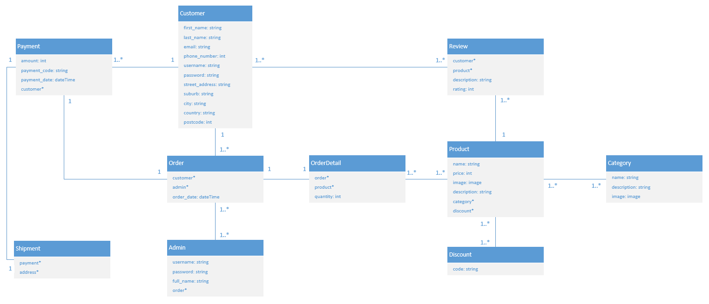

## Server-side Rendering

Server-side Rendering is considered to be a traditional method of serving HTML files when a request is made to the server and render these information onto the browser. Any interaction that makes a change to the website will cause the browser to make a request to the server and render the entire page once again. There is no cache that the browser can use to serve only the updated items. Pros and cons of Server-side Rendering are listed below:

- Pros:
  - Initial page render is fast
  - Good with static website
  - Better Search Engine Optimization
- Cons:
  - Render the entire page
  - Not good for website that has a lot of interactions
  - Frequent server requests
  - Slow rendering process if the content is complex

## Redis Cache + PostgreSQL Addons

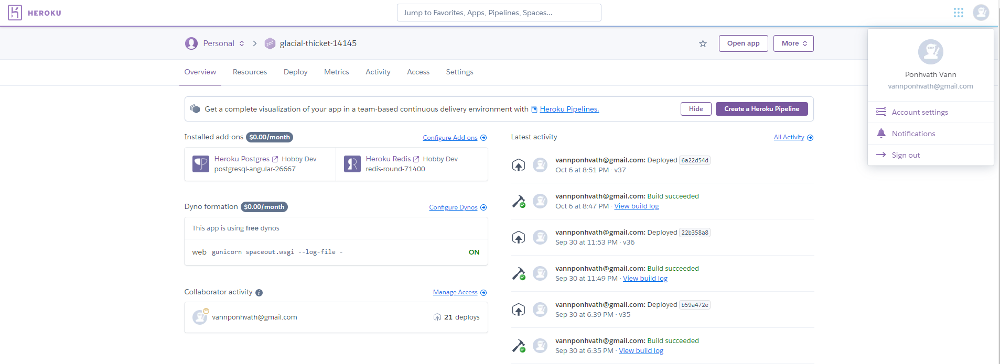

## Celery

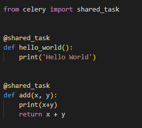
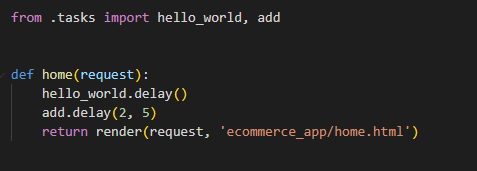

## Amazon S3

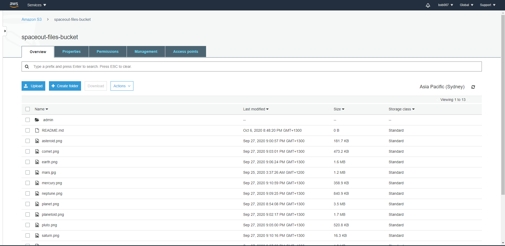

## Sendgrid

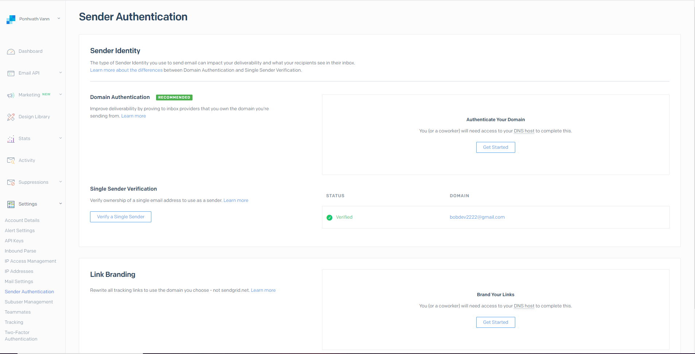

## Sentry

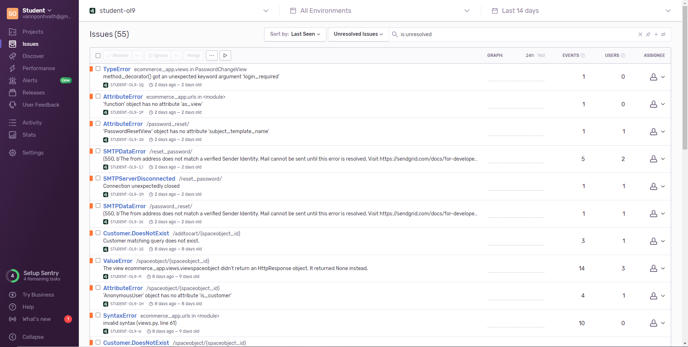

## DNS

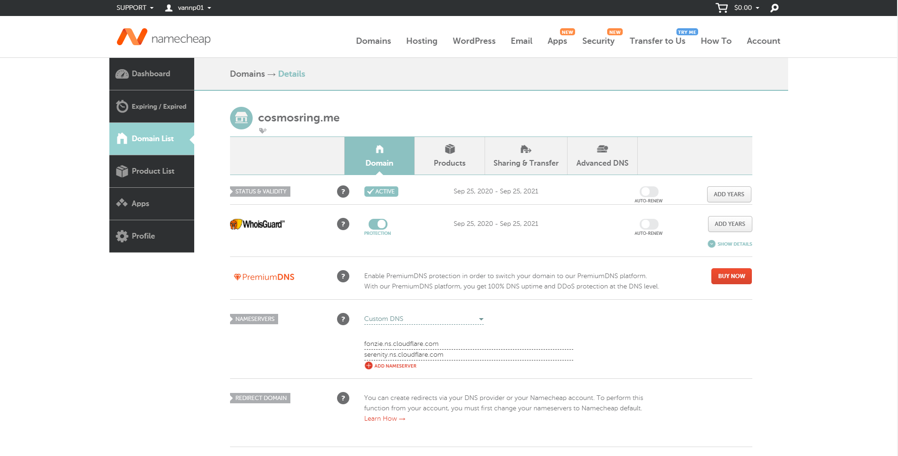

## Cloudflare

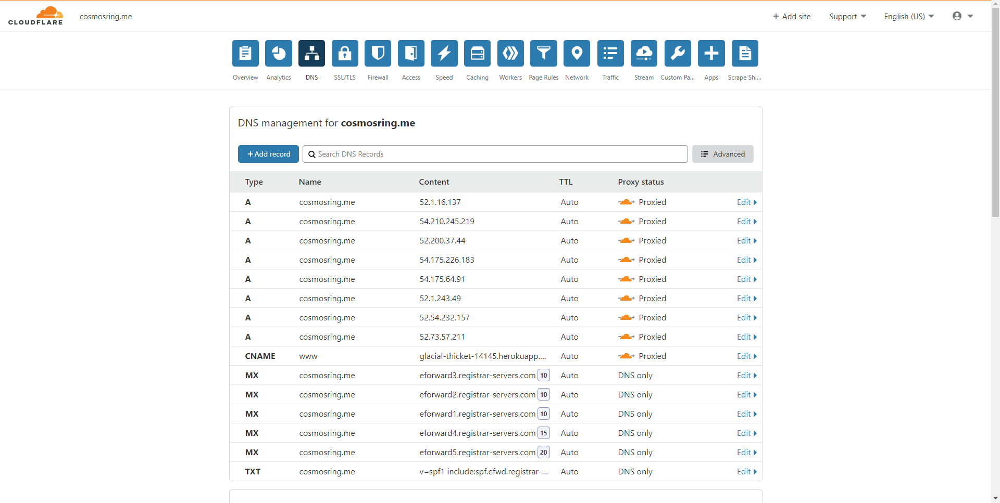

## PostgreSQL configuration

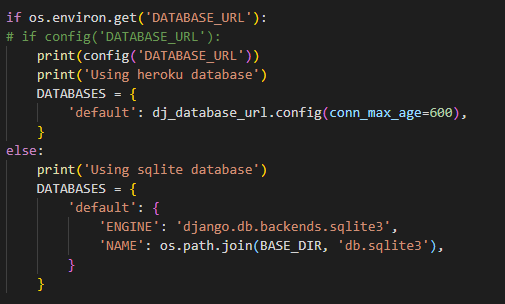

## Task 5 configurations

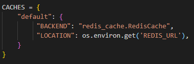
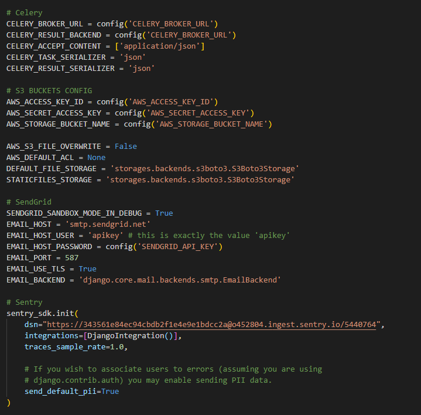

## Email Sign up

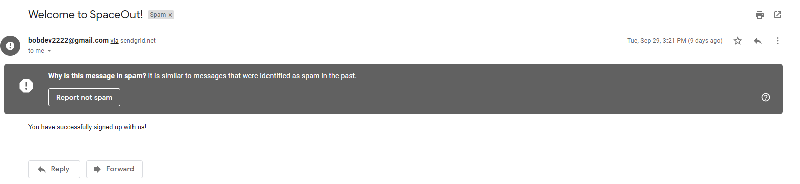

## Email Forgot password

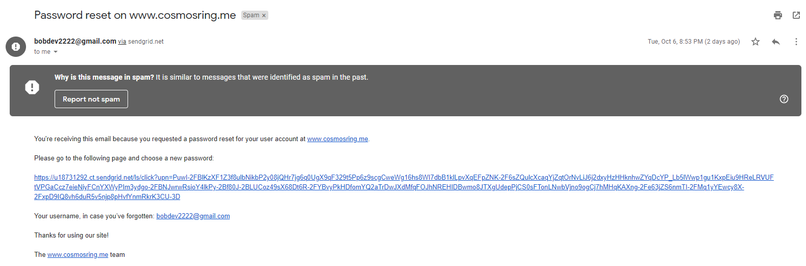

## Django Signals

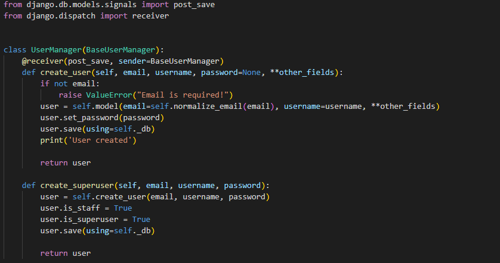

## Django Messages

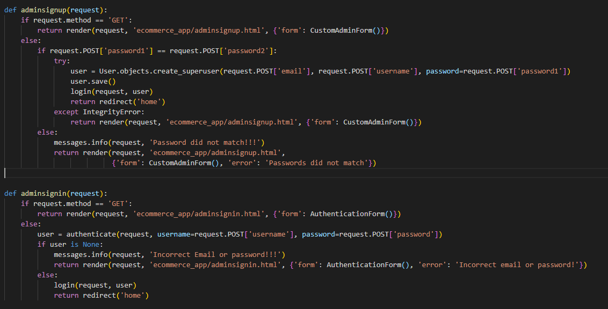
